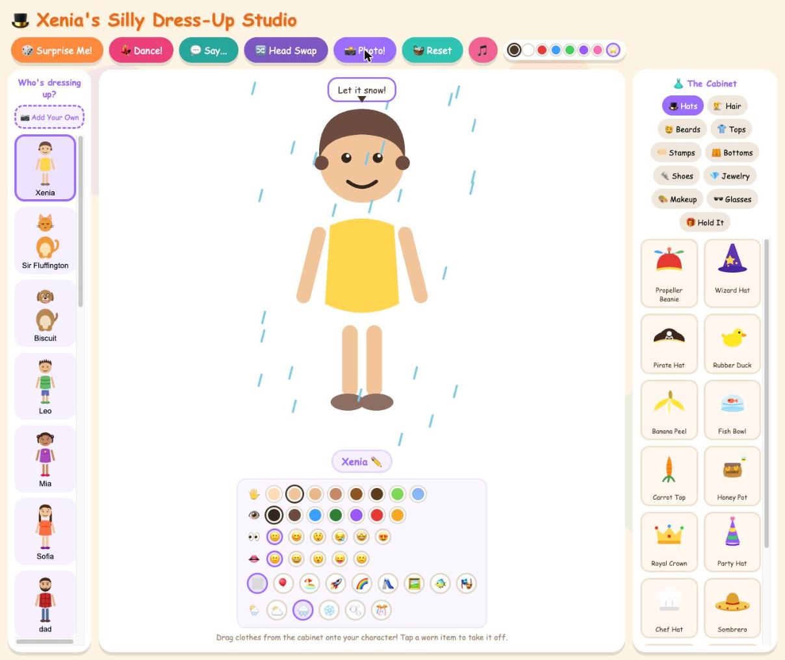

# 🎩 Xenia's Silly Dress-Up Studio

A drag-and-drop dress-up game I built for my daughter Xenia, for fun.

Pick a person or an animal, drag clothes out of the cabinet onto them, and make
the silliest outfit you can. A cat in clown shoes and a wizard beard. A
lumberjack in a princess gown and rainbow hair. A fish wearing a snorkel — who
will point out that he already breathes water.



## Play it

No build step, no dependencies, no accounts. Serve the folder and open it:

```bash
cd /Users/meletis.belsis/Documents/GitHub/game
python3 -m http.server 8321
```

Then open **http://localhost:8321** in your browser. Stop the server with
`Ctrl+C`. (Don't just double-click `index.html` — over `file://` the browser
blocks the offline support and the photo export.)

To put it on a phone or tablet, see [INSTALL.md](INSTALL.md) — it installs to
the Home Screen like a normal app and works offline.

## What's in it

- **26 characters** — toddlers, kids, teens, grown-ups, a grandma and grandpa,
  and fourteen animals including a cow, a horse, a pig, a frog, an elephant, a
  lizard, a parrot and a fish that stands on its tail
- **~160 wardrobe items** across eleven drawers: hats, hair, beards, tops,
  stamps, bottoms, shoes, jewellery, makeup, glasses, and things to hold
- **Make your own character from a photo** 📷 — take a picture, frame the face,
  slide from *Photo* to *Drawing* to cartoon it, and it joins the shelf with a
  body that wears everything. The picture never leaves the device.
- **Customise everything** — skin tones, animal fur colours, eye colour, eye
  and mouth shapes, hair and beard colours (including rainbow)
- **Ten backgrounds** — party, beach, space, meadow, playground, kitchen,
  poster wall, under the sea, theatre stage — with rain, snow, bubbles or confetti falling
  over them
- **Silly reactions** — every item gets a quip, and the right animal in the
  right item gets a special one ("DO NOT eat your necklace. DO NOT.")
- **💃 Dance**, **💬 Say...** (type what they say), **🔀 Head Swap**, **🎲
  Surprise Me!**, and background music that is generated live so it never
  loops the same way twice
- **📸 Photo booth** — save the finished character as a picture, with the scene,
  the speech bubble and a name plate

## How it's built

Plain HTML, CSS and vanilla JavaScript. No frameworks, no build tooling, no
libraries. Every character and clothing item is hand-written inline SVG, the
sound effects and music are synthesized with the Web Audio API, and the cartoon
photo filter is written from scratch on a canvas. The only binary files in the
repo are the app icons and the screenshot above.

```
index.html          layout: character shelf, stage, cabinet
css/style.css       kid-friendly theme and animations
js/backgrounds.js   the scenes
js/characters.js    character art + anchor points
js/wardrobe.js      every wearable item
js/photo.js         photo → cartoon character
js/music.js         the generative soundtrack
js/main.js          state, rendering, drag & drop, photo booth
```

See [DESIGN.md](DESIGN.md) for the full design and [CLAUDE.md](CLAUDE.md) for
the architecture notes.

## Privacy

Nothing is uploaded, tracked or collected. There are no ads, no links out, and
no accounts. Photos used to make characters are processed in the browser and
stored only on that device.

## Credits

Made with love for Xenia — who art-directed it, found the bugs, and insisted on
the rainbow hair. 🌈
